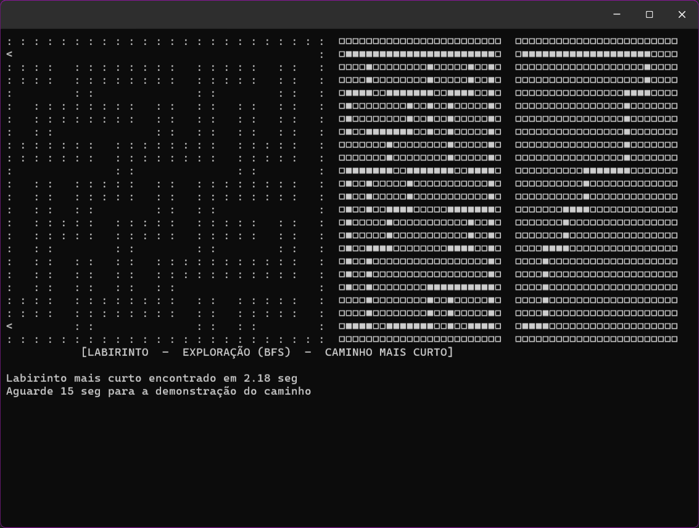
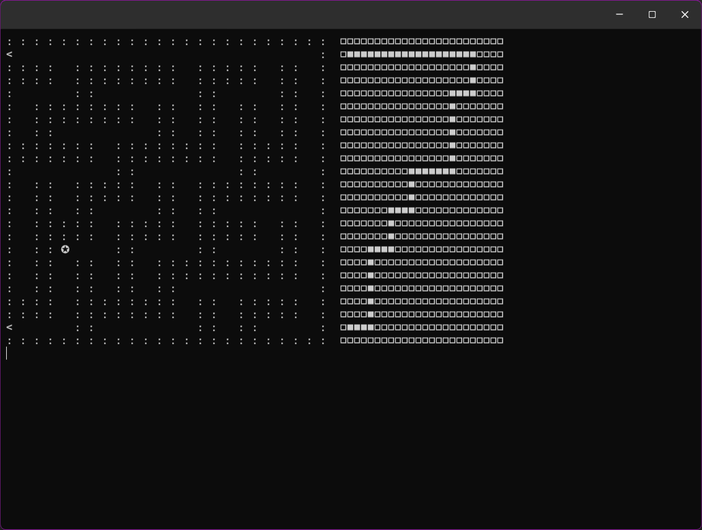

# Desafio do Labirinto Inteligente
 
 Implementar um agente racional capaz de encontrar o caminho mais curto através de um labirinto, utilizando técnicas de resolução de problemas.\
 Desenvolvido em Python.
 | 
-|-